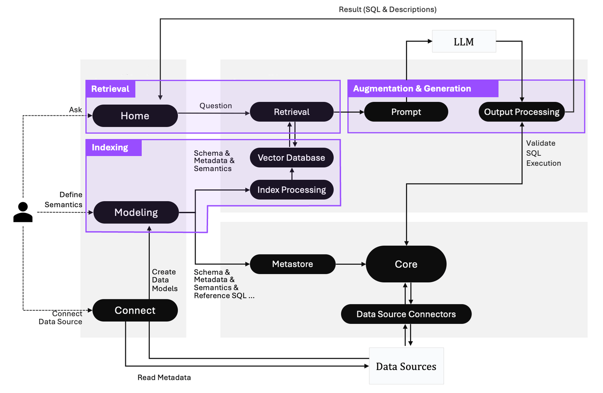

  <a>
    <h1 align="center">Percepta AI</h1>
  </a>

> Percepta AI is a **text-to-SQL solution** for data teams to get results and insights faster by asking business questions without writing SQL.

https://github.com/user-attachments/assets/3d9d0c66-25f6-4dda-9d68-dddfb2fc0f52

## 👊 Text-to-SQL End-To-End Solution

### 1. Indexing With Semantics

> Percepta AI has implemented a semantic engine architecture to provide the LLM context of your business; you can easily establish a logical presentation layer on your data schema that helps LLM learn more about your business context.

### 2. Augment LLM Prompts

> With Percepta AI, you can process metadata, schema, terminology, data relationships, and the logic behind calculations and aggregations with [“Modeling Definition Language” (MDL), reducing duplicate coding and simplifying data joins.

### 3. Generate Insights

> When starting a new conversation in Percepta AI, your question is used to find the most relevant tables. From these, LLM generates three relevant questions for the user to choose from. You can also ask follow-up questions to get deeper insights.

### 4. Self-Learning Feedback Loop (Coming Soon)

> The AI self-learning feedback loop is designed to refine SQL augmentation and generation by collecting data from various sources. These include user query history, revision intentions, feedback, schema patterns, semantics enhancement, and query frequency.

## 🤔 Why Percepta AI?

We focus on providing an open, secure, and reliable text-to-SQL solution for everyone.

### 1. Turnkey Solution

> Percepta AI makes it easy to onboard your data. Discover and analyze your data with our user interface. Effortlessly generate results without needing to code.

### 2. Secure By Design

> Your database contents will never be transmitted to the LLM. Only metadata, like schemas, documentation, and queries, will be used in semantic search.

### 3. Open-Source

> Deploy Percepta AI anywhere you like on your own data, LLM APIs, and environment, it's free.

## 🤖 Percepta AI's Architecture

Percepta AI consists of three core services:

- ***Percepta UI:*** An intuitive user interface for asking questions, defining data relationships, and integrating data sources within Percepta AI's framework.

- ***Percepta AI Service:*** Processes queries using a vector database for context retrieval, guiding LLMs to produce precise SQL outputs.

- ***Percepta Engine:*** Serves as the semantic engine, mapping business terms to data sources, defining relationships, and incorporating predefined calculations and aggregations.

